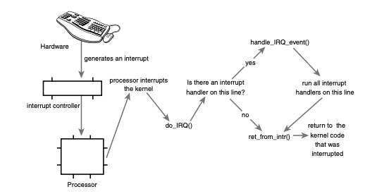

# Interrupts and Interrupt Handlers

Polling incurs overhead, a better solution is to provide a mechanism for the hardware to signal to the kernel when attention is needed.This mechanism is called an interrupt. In this chapter, we discuss interrupts and how the kernel responds to them, with special functions called interrupt handlers.

## Interrupts

Interrupts can occur at any time. Consequently, the kernel can be interrupted at any time to process interrupts. 中斷事件隨時會發生，因此，核心處理中斷事件的時候，也隨時可能被新來到的中斷給打斷。

An interrupt is physically produced by electronic signals originating from hardware devices and directed into input pins on an interrupt controller, a simple chip that multiplexes multiple interrupt lines into a single line to the processor. Upon receiving an interrupt, the interrupt controller sends a signal to the processor. The processor detects this signal and interrupts its current execution to handle the interrupt. The processor can then notify the operating system that an interrupt has occurred, and the operating system can handle the interrupt appropriately. 
1. 硬體裝置產生中斷訊號送到中斷控制器
2. 中斷控制器收到後送出相印的信號給處理器
3. 處理器暫停手上工作處理中斷，通知作業系統
4. 作業系統處理
5. 通知硬體已做處理 (這一點自己加的)

Different devices can be associated with different interrupts by means of a unique value associated with each interrupt. This enables the operating system to differentiate between interrupts and to know which hardware device caused which interrupt. In turn, the operating system can service each interrupt with its corresponding handler. 用不同的編號區分不同的中斷，讓作業系統得以用不同的處理程序處理中斷。 These interrupt values are often called interrupt request (IRQ) lines. Each IRQ line is assigned a numeric value. For example, on the classic PC, IRQ zero is the timer interrupt and IRQ one is the keyboard interrupt. 上述所說的編號常被稱為中斷請求線 (interrupt request/IRQ)，一個 IRQ 線會被分配一個號碼，例如 IRQ 0 代表 timer 中斷事件；IRQ 1 代表鍵盤中斷事件。其他如 PCI bus 的中斷編號則是動態分配的。

Much of the discussion of interrupts (asynchronous interrupts generated by hardware) in this chapter also pertains to exceptions (synchronous interrupts generated by the processor). Interrupts work in a similar way with system calls, except hardware—not software—issues interrupts. 中斷機制適用於例外和系統呼叫

## Interrupt Handlers

The function the kernel runs in response to a specific interrupt is called an **interrupt handler or interrupt service routine (ISR). Each device that generates interrupts has an associated interrupt handler 產生中斷的事件的每個裝置都會被關聯到一個中斷處理函式** .The interrupt handler for a device is part of the device’s driver—the kernel code that manages the device.

In Linux, interrupt handlers are normal C functions. They match a specific prototype, which enables the kernel to pass the handler information in a standard way. 這些 handlers 必須符合特定的函式原型，才能讓核心用標準的方式來傳遞處理程序所需的資訊。

What differentiates interrupt handlers from other kernel functions is that the kernel invokes them in response to interrupts and that they run in a special context (discussed later in this chapter) called interrupt context. This special context is occasionally called atomic context because, as we shall see, code executing in this context is unable to block. In this book, we will use the term interrupt context. 中斷處理程序最大的不同是，他們會被執行在一個稱為中斷環境的特殊環境，這個環境有時候稱為不可分割的環境。在此環境的程式碼執行是不能被阻擋。 

Because an interrupt can occur at any time, an interrupt handler can, in turn, be executed at any time. It is imperative that the handler runs quickly, to resume execution of the interrupted code as soon as possible. 中斷隨時都會發生，因此中斷處理程序隨時會被執行，我們需要這些程序快一點被處理完。

At the very least, an interrupt handler’s job is to acknowledge the interrupt’s receipt to the hardware: Hey, hardware, I hear ya; now get back to work! 中斷處理程序最起碼的工作是通知硬體已經收到它的中斷請求。

## Top Halves Versus Bottom Halves

These two goals—that an interrupt handler execute quickly and perform a large amount of work—clearly conflict with one another. Because of these competing goals, the processing of interrupts is split into two parts, or halves. **The interrupt handler is the top half. The top half is run immediately upon receipt of the interrupt and performs only the work that is time-critical**, such as acknowledging receipt of the interrupt or resetting the hardware. Work that can be performed later is deferred until the bottom half. The bottom half runs in the future, at a more convenient time, with all interrupts enabled. Linux provides various mechanisms for implementing bottom halves, and they are all discussed in Chapter 8, “Bottom Halves and Deferring Work.” 為了讓中斷處理程序快速的被執行完畢，中斷的處理被分成上下兩部，而中斷處理程序被稱為上半部，用來執行有時限要求的工作。可以延後的工作則延遲到下半部。

## Registering an Interrupt Handler

Drivers can register an interrupt handler and enable a given interrupt line for handling with the function request_irq(), which is declared in <linux/interrupt.h>: 

```cpp
/* request_irq: allocate a given interrupt line */ 
// request_irq 用來註冊 ISR 並且綁定及啟用給定的 irq
int request_irq(unsigned int irq,       // 中斷編號
                irq_handler_t handler,  // 函式指標
                unsigned long flags,    // 中斷處理程序旗標
                const char *name,       
                void *dev)              
```

* Interrupt Handler Flags
  * IRQF_DISABLED - 此 flag 設置時，表示該 ISR 執行時禁止其他中斷發生。通常不會設此 flag
  * IRQF_SHARED - 此 flag 用於指示此 irq 可提供多個 ISR 共享。（因此共享該 irq 的 ISR 都必須要設定此 flag）
* Name
  * ASCII 文字表示，在 /proc/irq 和 /proc/interrupts 會用這些名稱顯示給使用者看
* Dev
  * 當卸載驅動程式時，會需要使用 `void free_irq(unsigned int irq, void *dev)` 註銷 ISR 和 disable irq
  * 當 irq 不是共享的時候，會直接移除以及禁用（irq 在最後一個 ISR 被移除時才禁用）
  * 在 irq 是共享時，dev 提供了無一無二的 cookie，cookie 的作用就是用來告知核心指定的 irq 現在應該要移除哪些 ISR。共享 irq 的 ISR 註冊一定要給定 dev 而不能設置 NULL，因為 ISR 需要用該資訊來判斷在共享 irq 的情況之下，該裝置是否產生中斷（可能是共享 irq 的其他裝置所產生的）。


## Writing an Interrupt Handler

```cpp
static irqreturn_t intr_handler(int irq, void *dev)
```

上式即為 `request_irq()` 中 handler 的型態。在 Linux 2.0 之後引入 dev 的機制，因此第一個參數 irq 除了在印 log 時會用到外，其他時候不常使用。第二個參數 dev 是一個通用的指標，必須與 `request_irq()` 中的 dev 參數一致。`intr_handler` 的回傳值會是 IRQ_NONE 或 IRQ_HANDLED，在偵測到一個中斷時，若產生該中斷的裝置並非註冊時所指定的裝置時，會回傳 IRQ_NONE，若中斷處理程序正確被調用且裝置正確時，則會回傳 IRQ_HANDLED。ISR 是 static 的，因為它不會被位於別的檔案中的程式碼所調用。

#### Reentrancy and Interrupt Handlers

相比於 system calls 需要有 reentrancy 的性質，ISR 不需要此性質。因為中斷發生時，所以處理器上相同的中斷都會被遮罩掉，避免相同的中斷線上收到其它的中斷（其它中斷線正常作用）。

## Interrupt Context 

**When executing an interrupt handler, the kernel is in interrupt context.** Recall that process context is the mode of operation the kernel is in while it is executing on behalf of a process—for example, executing a system call or running a kernel thread. In process context, the current macro points to the associated task. Furthermore, because a process is coupled to the kernel in process context, process context can sleep or otherwise invoke the scheduler.

當執行一個 interrupt handler (ISR) 時，核心位於中斷環境 (interrupt context) 。先複習一下行程環境（process context），行程環境是核心代替行程執行時，核心所處的作業模式。例如，執行系統呼叫或是運行核心執行緒。在行程環境中，可以通過 current 巨集指向相關聯的 task。在這樣的環境之下可以休眠也可以調用排班。

Interrupt context, on the other hand, is not associated with a process. The current macro is not relevant (although it points to the interrupted process). 

相對來說，中斷環境與行程沒有關係。沒有行程的幫助，中斷環境不能休眠。所以你也能調用的函式也被限制了 (If a function sleeps, you cannot use it from your interrupt handler 不理解這是什麼意思，猜想是睡了會不知道如何叫起來，所以不要亂調用別的函式)。

中斷環境具有時間限制，因為中斷處理程序打斷了其它程式碼的執行，雖然可以用 `spinlock` (busy waiting)，但不鼓勵。複雜的事情應該抽離出來放在下半部。

## Implementing Interrupt Handlers



以上為一個中斷請求從硬體到核心的路徑
1. 裝置從匯流排傳送一個電子訊號給中斷控制器作為中斷請求
2. 在該中斷線不被遮罩掉的環境下，中斷控制器傳送中斷到處理器
3. 在處理器允許中斷的環境下（有可能不允許），處理器會立刻停止它正在做的事情，停用中斷系統，跳到預定義好的記憶體位置，並且執行該處的程式碼。該位置即為中斷處理程式的入口點 (the entry point for interrupt handlers)。
4. 對於每個中斷線，處理器都會跳到記憶體中一個獨一無二的位置。(LDK 沒有提到 interrupt vector 這個名詞)，如此，核心有辦法知道收到的中斷的 IRQ 編號；然後核心會呼叫 `do_IRQ()`。
5. `do_IRQ()` 會通知硬體它的中斷已經被收到，並禁止該中斷線傳遞中斷請求。
6. 再來，`do_IRQ()` 會確認該中斷線是否註冊有效的 ISR。且該 ISR 是否已經被啟用以及當前並無執行。
7. 檢查完畢後，`do_IRQ()` 會呼叫 `handle_IRQ_event()` 來執行對應的 ISR
8. ISR 返回後，回到 `do_IRQ()` 進行清理工作和呼叫 `ret_from_intr()` 返回入口點。
9. 最後要選擇決定下一個要執行什麼任務。當此中斷中斷的是一個用戶的行程時，則會呼叫 `schedule()` 決定要執行的行程；若是中斷核心的工作，則只有在 preempt_count 為零時才會呼叫 `schedule()`，否則搶佔核心是不安全的。

## /proc/interrupts

procfs 是一個虛擬的檔案系統，它僅存於核心記憶體中，通常被掛載到 /proc 目錄。讀寫該檔案系統時，所調用的核心函式會模擬真實檔案的讀寫。例如 /proc/interrupts 檔案會存放系統上與中斷相關的統計資料，如中斷線、所收到的中斷數目以及負責處理此中斷的中斷控制器名稱。procfs 的程式碼主要位於 fs/proc。

## Interrupt Control

在上上小節第 2 與第 3 個步驟中，分別有禁止中斷線與禁止中斷的情況發生，以下多做說明。

### Disabling and Enabling Interrupts

首先禁止中斷的主要理由為需要「同步」，通過禁止中斷可以防止其他中斷程序或是核心搶佔當前程式碼。同時我們會需要使用「鎖」來避免其它的處理器同時存取共享的資料。

```cpp
local_irq_disable();
/* interrupts are disabled .. */ 
local_irq_enable();
```

以上程式碼可以用來禁止當前處理器的本地中斷，但不夠好用，我們可以使用 `local_irq_save(flags)` 來禁止中斷，並且用 `local_irq_restore(flags)` 來「回復」中斷到先前的狀態。

```cpp
local_irq_save(flags); /* interrupts are now disabled */
/* ... */
local_irq_restore(flags); /* interrupts are restored to their previous state */
```

### Disabling a Specific Interrupt Line

In the previous section, we looked at functions that disable all interrupt delivery for an entire processor. In some cases, it is useful to disable only a specific interrupt line for the entire system. This is called masking out an interrupt line. Linux provides four interfaces for this task: 
前一小節是禁止處理器上所有的中斷傳遞的方法。某些情況之下我們只想要禁止一個特定的中斷線，Linux 提供了四個介面：

```cpp
void disable_irq(unsigned int irq);
void disable_irq_nosync(unsigned int irq); 
void enable_irq(unsigned int irq);
void synchronize_irq(unsigned int irq);
```

有點瑣碎，先略過，需要再看。但要知道避免禁止多個 ISR 所共享的中斷線。因為停用中斷線就是禁止該中斷線上所有裝置的中斷遞送。所以比較新的裝置的驅動程式傾向不使用這些介面。

### Status of the Interrupt System

以下兩個巨集可以用來檢查核心當前的環境
```cpp
in_interrupt() 
in_irq()
```
The most useful is the first: It returns nonzero if the kernel is performing any type of interrupt handling.This includes either executing an interrupt handler or a bottom half handler.The macro in_irq() returns nonzero only if the kernel is specifically executing an interrupt handler. 第一個巨集在核心正在執行一個中斷處理程序或是正在執行一個下半部處理程序時回傳零。第二個巨集類似，但不包括下半部。