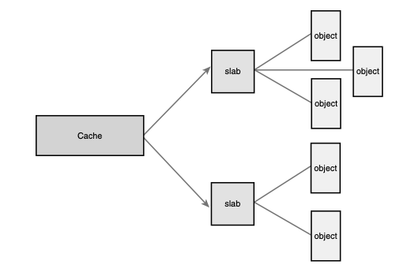

# Memory Management

Memory allocation inside the kernel is not as easy as memory allocation outside the kernel. For example, the kernel cannot easily deal with memory allocation errors, and the kernel often cannot sleep. Because of these limitations, and the need for a lightweight memory allocation scheme, getting hold of memory in the kernel is more complicated than in user-space. 
This chapter discusses the methods used to obtain memory inside the kernel. Before you can delve into the actual allocation interfaces, however, you need to understand how the kernel handles memory.

## Pages

The kernel treats physical pages as the basic unit of memory management. 核心將實體的頁面視為記憶體管理的基本單位。

```cpp
    struct page {
    unsigned long flags;    // the status of the page (dirty, etc)
    atomic_t _count;
    atomic_t _mapcount;
    unsigned long  private;
    struct address_space  *mapping;
    pgoff_t  index;
    struct list_head lru;
    void *virtual;          // the page’s virtual address
}
```

The kernel uses this data structure to describe the associated physical page. The data structure’s goal is to describe physical memory, not the data contained therein. 核心用此資料結構來描述相關聯的實體頁面。此資料結構的目的是在描述實體記憶體，而非其中所包含的資料。

The kernel uses this structure to keep track of all the pages in the system, because the kernel needs to know whether a page is free (that is, if the page is not allocated). 核心用此資料結構來記錄系統中所有的頁面，要知道一個頁面是否被分配，誰擁有此頁面。

perhaps a surprisingly large number in absolute terms, but only a small fraction of a percent relative to the system’s 4GB—not too high a cost for managing all the system’s physical pages. 此資料結構相當耗費記憶體，但就與管理系統所有實體頁面的比例來說，這代價不算太高

## Getting Pages

Let’s look at the interfaces the kernel implements to enable you to allocate and free memory within the kernel. 

The kernel provides one low-level mechanism for requesting memory, along with several interfaces to access it. All these interfaces allocate memory with page-sized granularity and are declared in <linux/gfp.h>.The core function is `struct page * alloc_pages(gfp_t gfp_mask, unsigned int order)` 核心提供數種為記憶體空間的請求的低階機制，這些介面都以頁面大小來分配記憶體空間，其中最重要的為 `alloc_pages()`，該函式會分配 2^order 個連續實體頁面，並傳回一個指標，指向第一個頁面的 page 結構。可以使用 `void * page_address(struct page *page)` 將其轉成 page 的邏輯位址。當你其實不需要使用 struct page 時，可以直接使用 `unsigned long __get_free_pages(gfp_t gfp_mask, unsigned int order)` 來取得 pages 的邏輯位置。若只需要一個頁面，可以使用簡單的 `struct page * alloc_page(gfp_t gfp_mask)` `unsigned long __get_free_page(gfp_t gfp_mask)` 其預設 order = 0，因此只會處理一個頁面。

### Getting Zeroed Pages
If you need the returned page filled with zeros, use the function `unsigned long get_zeroed_page(unsigned int gfp_mask)` 初始化對在分配給用戶空間時非常有用，避免敏感的資料傳給用戶空間。

### Freeing Pages

```cpp
void __free_pages(struct page *page, unsigned int order);
void free_pages(unsigned long addr, unsigned int order);
void free_page(unsigned long addr);
```
可以使用以上介面來釋放分配給你的頁面。與 user space 很大的不同的地方是，若你給的 struct page、地址或 order 是有問題的話，會直接導致系統崩潰。
以上是針對你需要以頁面為單位分配記憶體的方式，當你只是需要以位元組為單位的話，核心提供了 `kmalloc()`。

## kmalloc()

The function is declared in <linux/slab.h>: 

```cpp
void * kmalloc(size_t size, gfp_t flags)
```

此函式會傳回一個指標，指向一個記憶體範圍，此範圍至少有 size 個單位組。所分配的記憶體範圍實體上是連續的。發生錯誤時回傳 NULL。

### gfp_mask Flags

The flags are broken up into three categories: action modifiers, zone modifiers, and types. 動作修飾符、分區修飾符和類型
* Action modifiers specify how the kernel is supposed to allocate the requested memory. In certain situations, only certain methods can be employed to allocate memory. For example, interrupt handlers must instruct the kernel not to sleep (because interrupt han- dlers cannot reschedule) in the course of allocating memory. 動作修飾符用於指定核心該如何分配所請求的記憶體，例如：中斷處理程序必須要求分配記憶體時不能夠休眠）。
* Zone modifiers specify from where to allocate memory.As you saw earlier in this chapter,the kernel divides physical memory into multiple zones, each of which serves a different purpose. Zone modifiers specify from which of these zones to allocate. 分區修飾符用於指定要從何處分配記憶體（前面分區這個小節我直接略過，沒有讀）
* Type flags specify a combination of action and zone modifiers as needed by a certain type of memory allocation. 類型是直接動作修飾符與分區修飾符的組合，方便使用。

以下說明常用到的旗標：
* GFP_KERNEL: 絕大部分會使用的旗標，這種分配具有一般的優先權，有可能休眠，所以只能使用在可以重新排班的行程環境。沒有對請求的記憶體有任何規定，所以分配成功的機率很高。
* GFP_ATOMIC: 光譜的另外一邊，用於指定無法休眠的記憶體分配，所以成功率較低(沒辦法休眠去搬頁面到硬碟)
* GFP_NOIO: 可能會遭到阻擋，但不會啟動任何磁碟 I/O 來滿足請求
* GFP_NOFS: 可能會遭到阻擋，但可能啟動磁碟 I/O 但不會啟動檔案 I/O 來滿足請求
* GFP_DMA: 指定需要從 ZONE_DMA 來滿足分配請求

### kfree()

The counterpart to kmalloc() is kfree(), which is declared in <linux/slab.h>: 
```cpp
void kfree(const void *ptr)
```
kfree 用來釋放 kmalloc 所分配的記憶體。若非 kmalloc 所分配的不能呼叫此函式，避免導致不良行為，例如釋放到不該釋放的記憶體。

## vmalloc()
The vmalloc() function works in a similar fashion to kmalloc(), except it allocates memory that is only virtually contiguous and not necessarily physically contiguous.This is how a user-space allocation function works: The pages returned by malloc() are contiguous within the virtual address space of the processor, but there is no guarantee that they are actually contiguous in physical RAM. vmalloc() 類似於 kmalloc()，但是不需要實體位址是連續的，這就是 user space 的 malloc 的行為，回傳的頁面在處理器的虛擬位址空間是連續的，但不保證在 RAM 上也是連續的。

**For the most part, only hardware devices require physically contiguous memory allo- cations**. 大部分的情況下，只有硬體裝置需要實體上連續的記憶體分配。並且大部分核心還是使用 kmalloc 因為 vmalloc 的機制可能會引發 thrashing 現象。

## Slab Layer

slab 層的作用如同一個通用的資料結構快取層。Linux 用 slab 層來幫助頻繁分配與釋放記憶體的機制。slab 會將不同的物件分組，並稱為快取區，每個快取區存放不同型態的物件。每種物件型態對映到一個快取區。例如： 會有一個快取區存放行程描述器 (task_struct 結構所組成的可用串列)，還有另外一個快取區存放 inode 物件。然後，kmalloc 介面建構在 slab 層之上，所使用的伊謝列通用的快取區。

接著快取區會被劃分成 slab。slab 由一個或多個實體連續的頁面所構成，通常是一個頁面。每個快取區可以由多個 slab 所構成。每個 slab 中包含了一些物件，這些物件就是被快取的資料結構。每個 slab 會處於三種狀況之一：full（全部使用）、partial（已部分使用）、empty（尚未使用）。full 中無可共使用的物件、empty slab 中沒有分配任何物件，partial 則有分配有還沒分配的物件。當核心某部分請求一個新物件，會從 partial 來滿足請求先，再來才是 empty。若 empty 並不存在，則會建立一個。



以下非 LKD:

buddy system：在內部保存一些 2 的 N 次方空間記憶體片段，如果要分配 3 pages，去 4 pages 的列表裡面取一個，分配 3 個之後將剩下的 1 個放回去，記憶體釋放的過程剛好是一個反向過程。buddy system 每次分配記憶體都以 page (4KB) 為單位，但系統執行時絕大部分的資料結構都是很小的，為一個小物件分配 4KB 顯然不划算。Linux 中使用 slab 來解決小物件的分配。

slab 向 buddy system 去「批發」一些記憶體，加工切塊以後「零售」出去。隨著大規模多核處理器和 NUMA 系統的廣泛應用，slab 終於暴露出其不足：

- 複雜的隊列管理
- 管理資料和隊列儲存開銷較大
- 長時間運行 partial 隊列可能會非常長
- 對 NUMA 支持非常複雜

為此，核心開發者引入 slub：改造 page 結構，削減 slab 管理結構的開銷、每個 CPU 都有一個本地活動的 slab (kmem_cache_cpu) 等等。對於小型的嵌入式系統存在一個 slab 模擬層 slob，在這種系統中它更有優勢。

## Statically Allocating on the Stack

In user-space, allocations such as some of the examples discussed thus far could have occurred on the stack because we knew the size of the allocation a priori. User-space is afforded the luxury of a large, dynamically growing stack, whereas the kernel has no such luxury—the kernel’s stack is small and fixed. kernel 中的堆疊使用無法像用戶空間那樣般的奢侈。核心 stack 是小而固定的，以減少耗用和管理。

32 位元架構上通常是 8KB (2 pages)，64 位元架構上通常是 16KB (2 pages)

In any given function, you must keep stack usage to a minimum. There is no hard and fast rule, but you should keep the sum of all local (that is, automatic) variables in a particular function to a maximum of a couple hundred bytes. Performing a large static allocation on the stack, such as of a large array or structure, is dangerous. Otherwise, stack allocations are performed in the kernel just as in user-space. Stack overflows occur silently and will undoubtedly result in problems. Because the kernel does not make any effort to manage the stack, when the stack overflows, the excess data simply spills into whatever exists at the tail end of the stack.The first thing to eat it is the thread_info structure. (Recall from Chapter 3 that this structure is allocated at the end of each process’s kernel stack.) Beyond the stack, any kernel data might lurk. At best, the machine will crash when the stack overflows. At worst, the overflow will silently corrupt data.
Therefore, it is wise to use a dynamic allocation scheme, such as one of those previously discussed in this chapter for any large memory allocations.

盡量不要使用 stack，雖然沒有嚴格規定。但若默默的超過 stack 的限制，就會發生 overflow，超出的資料會覆蓋掉緊接在 stack 尾端的內容，首先會受到影響的是 thread_info 結構。此時最好的情況是機器當掉，最糟的情況是資料默默受到破壞。因此使用動態分配才是明智的選擇。ㄊ
